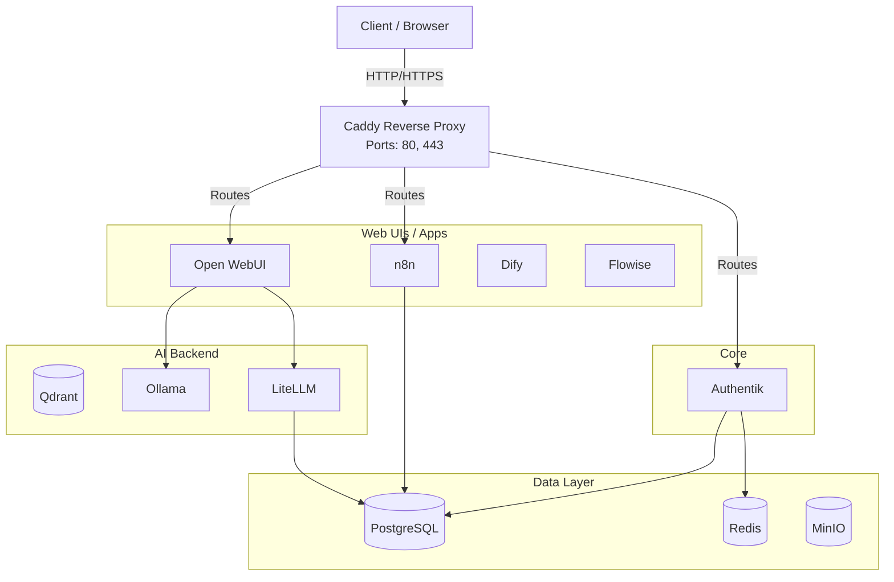
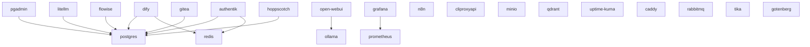
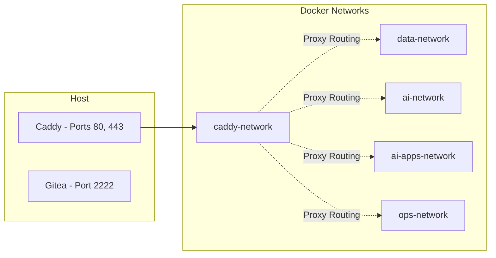

# 🧠 BRAIN MAP: docker-omni-stack

Welcome to the definitive reference document for the `docker-omni-stack` repository. This Brain Map is a single, exhaustive, structured knowledge graph designed for human developers and agentic AIs to fully understand, summarize, plan, and develop this project further.

---

## 🧠 1. Meta

- **Project Identity:** `docker-omni-stack`
- **Purpose:** A highly modular, general-purpose Docker infrastructure framework managed natively via PowerShell. Allows dynamic mix-and-match of 22 pre-configured microservices to build local private AI ecosystems, data processing pipelines, web hosting stacks, or API development suites.
- **Philosophy:** Strict isolation, dynamic routing, explicit dependencies, centralized configuration, and CLI-driven orchestration.
- **Versioning:** Unversioned rolling framework.

---

## 🏗️ 2. Architecture

**System Topology & Data Flow**
Traffic flows from the host machine to Caddy (Reverse Proxy), which then dynamically routes the traffic to isolated internal Docker networks. 



---

## 🐳 3. Services Catalog

| Service | Group | Internal Port | Compose File | Env File | Dependencies | Purpose |
|---------|-------|---------------|--------------|----------|--------------|---------|
| **n8n** | automation | 5678 | `compose/n8n.yml` | `config/n8n.env` | None | Workflow automation engine with visual node-based editor |
| **cliproxyapi** | automation | 8317 | `compose/cliproxyapi.yml` | `config/cliproxyapi.env` | None | CLI proxy API gateway for command-line tool integration |
| **postgres** | data | 5432 | `compose/postgres.yml` | `config/postgres.env` | None | Primary relational database (shared across multiple services) |
| **redis** | data | 6379 | `compose/redis.yml` | `config/redis.env` | None | In-memory cache and message broker for session/queue management |
| **minio** | data | 9001 | `compose/minio.yml` | `config/minio.env` | None | S3-compatible object storage for file and artifact management |
| **qdrant** | ai | 6333 | `compose/qdrant.yml` | `config/qdrant.env` | None | Vector similarity search engine for AI embeddings |
| **pgadmin** | data | 80 | `compose/pgadmin.yml` | `config/pgadmin.env` | postgres | Web-based PostgreSQL database administration UI |
| **ollama** | ai | 11434 | `compose/ollama.yml` | `config/ollama.env` | None | Local large language model inference server |
| **litellm** | ai | 4000 | `compose/litellm.yml` | `config/litellm.env` | postgres | OpenAI-compatible API proxy translating to local LLM endpoints |
| **open-webui** | ai-apps | 8080 | `compose/open-webui.yml` | `config/open-webui.env` | ollama | Chat interface for interacting with local LLMs |
| **flowise** | ai-apps | 3000 | `compose/flowise.yml` | `config/flowise.env` | postgres | Visual drag-and-drop LLM flow builder |
| **dify** | ai-apps | 5001 | `compose/dify.yml` | `config/dify.env` | postgres, redis | LLM application development platform with RAG capabilities |
| **uptime-kuma**| monitoring| 3001 | `compose/uptime-kuma.yml` | `config/uptime-kuma.env` | None | Self-hosted uptime monitoring and status page |
| **prometheus** | monitoring| 9090 | `compose/prometheus.yml` | `config/prometheus.env` | None | Time-series metrics collection and alerting engine |
| **grafana** | monitoring| 3000 | `compose/grafana.yml` | `config/grafana.env` | prometheus | Metrics visualization and dashboarding platform |
| **caddy** | core | 80, 443 | `compose/caddy.yml` | `config/caddy.env` | None | Dynamic reverse proxy and automatic HTTPS gateway (single ingress point) |
| **authentik** | auth | 9000 | `compose/authentik.yml` | `config/authentik.env` | postgres, redis | Identity provider and SSO authentication server |
| **rabbitmq** | optional | 15672 | `compose/rabbitmq.yml` | `config/rabbitmq.env` | None | Message queue broker for async event-driven architectures |
| **gitea** | development| 3000 | `compose/gitea.yml` | `config/gitea.env` | postgres | Self-hosted Git service for source code management |
| **tika** | processing| 9998 | `compose/tika.yml` | `config/tika.env` | None | Apache Tika document content extraction and analysis server |
| **gotenberg** | processing| 3000 | `compose/gotenberg.yml` | `config/gotenberg.env` | None | API-based document conversion engine (HTML/Office to PDF) |
| **hoppscotch** | tools | 3000 | `compose/hoppscotch.yml` | `config/hoppscotch.env`| postgres | Open-source API development and testing platform |

---

## 🔀 4. Dependency Graph



---

## 🌐 5. Network Topology


*Note: Due to strict network isolation, containers on `ai-apps-network` (e.g., open-webui) must also join `ai-network` to communicate with backend AI services like Ollama.*

---

## 🔧 6. CLI & Orchestration

**Entrypoint:** `stack.ps1`

- `.\stack setup`: First-time setup, initializes files.
- `.\stack up <services>`: Starts specified services and their dependencies.
- `.\stack up -Group <group>`: Starts all services in a predefined group.
- `.\stack down`: Stops and removes containers/networks.
- `.\stack restart`: Restarts services.
- `.\stack logs`: View logs.
- `.\stack services`: Lists registry services.
- `.\stack groups`: Lists registry groups.
- `.\stack status`: Shows container status.
- `.\stack health`: Tests and shows health status.

**Scripts (`scripts/`):**
- `Registry.ps1`: Defines the `$Registry` of all 22 services, ports, dependencies, and groups.
- `Stack-Commands.ps1`: Implements the core CLI actions.
- `Stack-Helpers.ps1`: Utility functions (e.g., getting Compose args).
- `Configure-Routing.ps1`: Dynamically generates Caddy proxy routing based on active services (`compose/caddy-dynamic.yml`).

---

## 📁 7. File Map

```
c:\Docker\
├── apps/               # Service-specific configuration templates (e.g. Caddyfile)
├── compose/            # 22 isolated Docker Compose .yml files + caddy-dynamic.yml
├── config/             # Environment variable files (.env) and examples
├── data/               # Persistent data storage (bind-mounted by default)
├── docs/               # Advanced operational guides
├── scripts/            # PowerShell orchestration modules
│   ├── Configure-Routing.ps1
│   ├── Registry.ps1
│   ├── Stack-Commands.ps1
│   └── Stack-Helpers.ps1
├── tests/              # Health check tracking
│   └── test-results.json
├── stack.ps1           # Main entrypoint script
├── README.md           # Project overview
├── BRAIN_MAP.md        # This document
└── final_audit_report.md # Historical audit log
```

---

## ⚙️ 8. Configuration Matrix

| Env Var | File | Default / Value | Description |
|---|---|---|---|
| `AUTHENTIK_CONTAINER_NAME` | `authentik.env.example` | `authentik` | Docker container name for Authentik server |
| `AUTHENTIK_SECRET_KEY` | `authentik.env.example` | `change_me` | Secret key for Authentik session encryption and signing |
| `AUTHENTIK_WORKER_CONTAINER_NAME` | `authentik.env.example` | `authentik_worker` | Docker container name for Authentik background worker |
| `CADDY_CONTAINER_NAME` | `caddy.env.example` | `caddy` | Docker container name for Caddy reverse proxy |
| `CADDY_HTTP_PORT` | `caddy.env.example` | `80` | Host port for HTTP traffic ingress |
| `CADDY_HTTPS_PORT` | `caddy.env.example` | `443` | Host port for HTTPS traffic ingress |
| `CLIPROXYAPI_CONTAINER_NAME` | `cliproxyapi.env.example` | `cliproxyapi` | Docker container name for CLI Proxy API |
| `CLIPROXYAPI_KEY` | `cliproxyapi.env.example` | `change_me` | API authentication key for CLI Proxy access |
| `DIFY_CONTAINER_NAME` | `dify.env.example` | `dify` | Docker container name for Dify LLM platform |
| `FLOWISE_CONTAINER_NAME` | `flowise.env.example` | `flowise` | Docker container name for Flowise flow builder |
| `GITEA_CONTAINER_NAME` | `gitea.env.example` | `gitea` | Docker container name for Gitea git server |
| `GITEA_SSH_PORT` | `gitea.env.example` | `2222` | Host port for Gitea SSH git operations |
| `TZ` | `global.env.example` | `Asia/Kolkata` | Global timezone for all containers (IANA format) |
| `PROJECT_NETWORK_PREFIX` | `global.env.example` | `project` | Prefix prepended to all Docker network names |
| `PROJECT_DATA_DIR` | `global.env.example` | `../data` | Relative path to persistent data storage directory |
| `PROJECT_APPS_DIR` | `global.env.example` | `../apps` | Relative path to service-specific app configurations |
| `POSTGRES_USER` | `global.env.example` | `change_me` | PostgreSQL superuser username (shared across all services) |
| `POSTGRES_PASSWORD` | `global.env.example` | `change_me` | PostgreSQL superuser password (shared across all services) |
| `POSTGRES_DB` | `global.env.example` | `app_db` | Default PostgreSQL database name |
| `USE_DOCKER_VOLUMES` | `global.env.example` | `true` | Toggle between Docker volumes (true) and bind mounts (false) |
| `GOTENBERG_CONTAINER_NAME` | `gotenberg.env.example` | `gotenberg` | Docker container name for Gotenberg PDF converter |
| `GRAFANA_CONTAINER_NAME` | `grafana.env.example` | `grafana` | Docker container name for Grafana dashboards |
| `GRAFANA_ADMIN_USER` | `grafana.env.example` | `change_me` | Grafana admin panel username |
| `GRAFANA_ADMIN_PASSWORD` | `grafana.env.example` | `change_me` | Grafana admin panel password |
| `HOPPSCOTCH_CONTAINER_NAME` | `hoppscotch.env.example` | `hoppscotch` | Docker container name for Hoppscotch API tester |
| `HOPPSCOTCH_DATA_ENCRYPTION_KEY` | `hoppscotch.env.example` | `change_me_encryption_key` | Encryption key for Hoppscotch stored API data |
| `HOPPSCOTCH_WHITELISTED_ORIGINS` | `hoppscotch.env.example` | `http://localhost:3010,http://127.0.0.1:3010,http://localhost:3000,app://localhost_3200,app://hoppscotch` | Comma-separated CORS allowed origins for Hoppscotch |
| `HOPPSCOTCH_JWT_SECRET` | `hoppscotch.env.example` | `change_me_jwt_secret` | JWT signing secret for Hoppscotch authentication tokens |
| `HOPPSCOTCH_SESSION_SECRET` | `hoppscotch.env.example` | `change_me_session_secret` | Session cookie signing secret for Hoppscotch |
| `HOPPSCOTCH_VITE_BASE_URL` | `hoppscotch.env.example` | `http://hoppscotch.localhost` | Client-facing base URL for Hoppscotch web app |
| `LITELLM_CONTAINER_NAME` | `litellm.env.example` | `litellm` | Docker container name for LiteLLM API proxy |
| `LITELLM_MASTER_KEY` | `litellm.env.example` | `sk-change_me` | Master API key for LiteLLM admin access |
| `MINIO_CONTAINER_NAME` | `minio.env.example` | `minio` | Docker container name for MinIO object storage |
| `MINIO_ROOT_USER` | `minio.env.example` | `change_me` | MinIO admin console username |
| `MINIO_ROOT_PASSWORD` | `minio.env.example` | `change_me` | MinIO admin console password |
| `N8N_CONTAINER_NAME` | `n8n.env.example` | `n8n` | Docker container name for n8n workflow engine |
| `GENERIC_TIMEZONE` | `n8n.env.example` | `Asia/Kolkata` | n8n-specific timezone override (IANA format) |
| `OLLAMA_CONTAINER_NAME` | `ollama.env.example` | `ollama` | Docker container name for Ollama LLM server |
| `OPEN_WEBUI_CONTAINER_NAME` | `open-webui.env.example` | `open-webui` | Docker container name for Open WebUI chat interface |
| `PGADMIN_CONTAINER_NAME` | `pgadmin.env.example` | `pgadmin` | Docker container name for pgAdmin database UI |
| `PGADMIN_DEFAULT_EMAIL` | `pgadmin.env.example` | `admin@admin.com` | pgAdmin login email address |
| `PGADMIN_DEFAULT_PASSWORD` | `pgadmin.env.example` | `change_me` | pgAdmin login password |
| `POSTGRES_CONTAINER_NAME` | `postgres.env.example` | `postgres` | Docker container name for PostgreSQL database server |
| `PROMETHEUS_CONTAINER_NAME` | `prometheus.env.example` | `prometheus` | Docker container name for Prometheus metrics collector |
| `QDRANT_CONTAINER_NAME` | `qdrant.env.example` | `qdrant` | Docker container name for Qdrant vector database |
| `RABBITMQ_CONTAINER_NAME` | `rabbitmq.env.example` | `rabbitmq` | Docker container name for RabbitMQ message broker |
| `RABBITMQ_USER` | `rabbitmq.env.example` | `change_me` | RabbitMQ management console username |
| `RABBITMQ_PASSWORD` | `rabbitmq.env.example` | `change_me` | RabbitMQ management console password |
| `REDIS_CONTAINER_NAME` | `redis.env.example` | `redis` | Docker container name for Redis cache server |
| `TIKA_CONTAINER_NAME` | `tika.env.example` | `tika` | Docker container name for Apache Tika document parser |
| `UPTIME_KUMA_CONTAINER_NAME` | `uptime-kuma.env.example` | `uptime-kuma` | Docker container name for Uptime Kuma monitor |

---

## 🔒 9. Security Model

- **Authentication:** Managed centrally by Authentik (SSO).
- **Network Isolation:** Services are segregated into purpose-built Docker bridge networks (`data-network`, `ai-network`, etc.).
- **Host Exposure:** Extremely restricted. Only Caddy exposes ports (80/443). Gitea exposes SSH (2222). All other web interfaces are proxy-routed internally by Caddy using virtual subdomains (`http://<service>.localhost`).
- **Secrets:** Stored in `.env` files in `config/`. Shared credentials (DB) are centralized in `global.env`.

---

## 📊 10. Monitoring & Observability

- **Metrics Collection:** Prometheus scrapes endpoints across the stack.
- **Visualization:** Grafana provides dashboards for Prometheus data.
- **Uptime Tracking:** Uptime Kuma tracks service availability and provides status pages.

---

## 🧪 11. Testing & Health

- **Mechanism:** Relies entirely on Docker `healthcheck` declarations inside `compose/*.yml`.
- **CLI Command:** `.\stack health` parses these health states and generates `tests/test-results.json`.
- **Gaps:** Limited to binary health checks. No e2e integration tests (e.g., verifying Open-WebUI can talk to Ollama).

---

## 📖 12. Documentation Index

- `README.md`: High-level overview, quick start, architecture intro.
- `SETUP.md`: First-time setup, volumes vs bind-mounts.
- `SERVICES.md`: Catalog of services and dependencies.
- `USE_CASES.md`: Deployment blueprints for specific stack configurations.
- `INFRASTRUCTURE.md`: Deep dive into Caddy routing and orchestration logic.
- `docs/authentication.md`: SSO and proxy access control.
- `docs/networking.md`: Caddy topology and virtual hosts.
- `docs/security.md`: Best practices.
- `docs/backup.md`: Data persistence strategies.
- `docs/troubleshooting.md`: Common errors and fixes.

---

## 🚀 13. Growth Vectors

| Vector | Difficulty | Description |
|--------|------------|-------------|
| **Big Data Pipelines** | Hard | Integrate Apache Kafka, Spark, or Flink into a new `data-pipeline` network group. |
| **Agentic Frameworks** | Medium | Add CrewAI, AutoGen, or Langflow containers to the `ai-apps` ecosystem. |
| **Swarm / K8s Migration**| Hard | Translate `stack.ps1` orchestration and compose files into Helm charts or Kustomize manifests. |
| **Integration Testing** | Medium | Introduce Playwright or Cypress to perform e2e tests between services. |
| **Custom Service Templates** | Easy | Create a `templates/` directory with boilerplate compose/env/registry entries for quickly adding new services |
| **Secrets Management** | Medium | Migrate from plaintext .env files to Docker Secrets or HashiCorp Vault |
| **Log Aggregation** | Medium | Add ELK/Loki stack for centralized logging |
| **Backup Automation** | Medium | Automated backup scripts for volumes and databases |
| **Multi-Environment Support** | Hard | Support dev/staging/prod profiles with environment-specific overrides |

---

## ⚠️ 14. Technical Debt & Risks

- **DEBT-01 (MEDIUM):** Stale audit artifacts (`final_audit_report.md`, `audit_report.md`) contain inaccurate information that confuses automated agents.
- **DEBT-02 (MEDIUM):** Testing is limited to surface-level Docker health checks; no end-to-end integration tests verify cross-container communication.
- **DEBT-03 (LOW):** Single-node PowerShell orchestration limits multi-node scalability.

---

## 🗺️ 15. Roadmap Suggestions

1. Clean up stale audit artifacts to prevent agent confusion
2. Build end-to-end integration testing suite
3. Add health checks to all services (currently only postgres has one)
4. Expand AI agent frameworks (CrewAI, AutoGen)
5. Document Kubernetes migration path
6. Add more growth vectors with detailed per-service cards

---

## 🤖 16. Agent Instructions

**For AI Agents Working on `docker-omni-stack`:**

1. **Single Source of Truth:** `scripts/Registry.ps1` is the absolute authority on what services exist, their ports, and their dependencies.
2. **Adding a New Service:**
   - Create `compose/<service>.yml`.
   - Create `config/<service>.env` and `config/<service>.env.example`.
   - Register it in `$Registry` in `scripts/Registry.ps1` (with `Group`, `InternalPort`, and `DependsOn`).
   - DO NOT define host ports in compose files (except for Caddy). Rely on `Configure-Routing.ps1` to dynamically expose it via `<service>.localhost`.
3. **Dependencies:** If your new service requires a database, add it to `DependsOn = @("postgres")`. `stack.ps1` will auto-launch it.
4. **Environment Variables:** Do not redefine `POSTGRES_*` in service-specific env files; inherit them via `global.env` sourcing in `Stack-Helpers.ps1`.
5. **Modification Etiquette:** Always update `BRAIN_MAP.md` and `SERVICES.md` when introducing new services or changing topologies.
